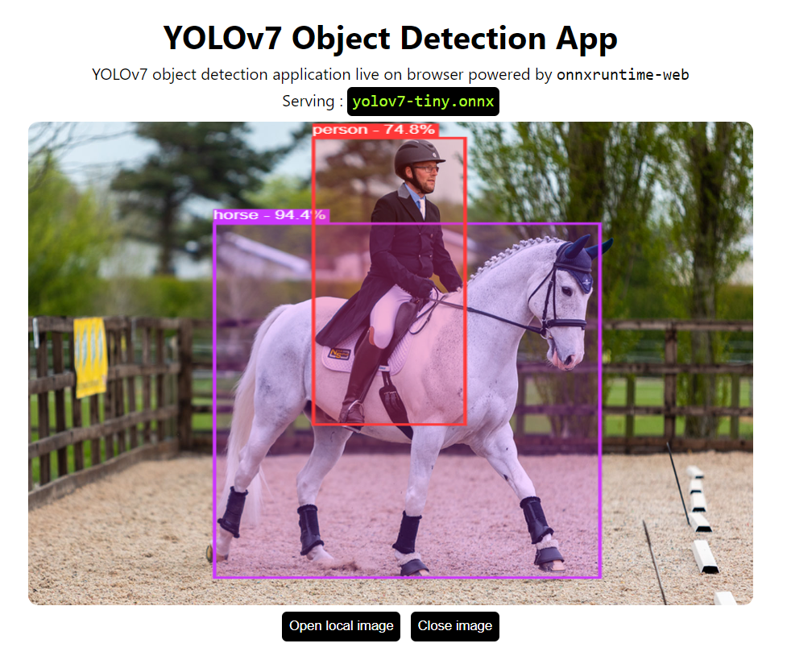

# YOLOv7 on onnxruntime-web

<p align="center">
  
</p>


---

**[Playground](https://hyuto.github.io/yolov7-onnxruntime-web/)**

---

Object Detection application right in your browser.
Serving YOLOv7 in browser using onnxruntime-web with `wasm` backend.

## Setup

```bash
git clone https://github.com/Hyuto/yolov7-onnxruntime-web.git
cd yolov7-onnxruntime-web
yarn install # Install dependencies
```

## Scripts

```bash
yarn start # Start dev server
yarn build # Build for productions
```

## Model

YOLOv7 model converted to onnx model.

```
used model : yolov7-tiny
size       : 24 MB
```

### Use Another Model

> :warning: **Size Overload** : used YOLOv7 model in this repo is the smallest with size of 24 MB, so other models is definitely bigger than this which can cause memory problems on browser.

Use another YOLOv7 model.

1. Clone [yolov7](https://github.com/WongKinYiu/yolov7) repository

   ```bash
   git clone https://github.com/WongKinYiu/yolov7.git && cd yolov7
   ```

   Install `requirements.txt` first

   ```bash
   pip install -r requirements.txt
   ```

   Then export desired YOLOv7 model and configurations to onnx

   ```bash
   python export.py --weights <YOLOv7-MODEL>.pt --grid --end2end --simplify \
        --topk-all 100 --iou-thres 0.65 --conf-thres 0.35 --img-size 640 640 --max-wh 640
   ```

   **Note** : You can run it on colab too

   [](https://colab.research.google.com/github/WongKinYiu/yolov7/blob/main/tools/YOLOv7onnx.ipynb)

2. Copy `yolov7*.onnx` to `./public/model`
3. Update `modelName` in `App.jsx` to new model name
   ```jsx
   ...
   // configs
   const modelName = "yolov7*.onnx"; // change to new model name
   const modelInputShape = [1, 3, 640, 640];
   ...
   ```
4. Done! 😊

## Reference

- https://github.com/WongKinYiu/yolov7
- https://github.com/ultralytics/yolov5
